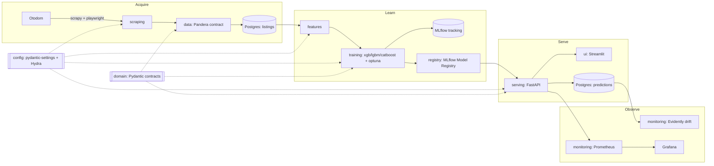

# PricePredictor

**End-to-end MLOps pipeline that predicts Polish real-estate prices from
Otodom listings** — scraping, validated data contracts, training with
experiment tracking, a registry-backed inference API, a Streamlit demo,
and drift monitoring. Built to portfolio quality: strict typing,
Protocol-first interfaces, dependency injection, and a reproducible
toolchain.

> **Status: Phase 1 — skeleton.** Every module exposes typed interfaces
> and contracts; behaviour raises `NotImplementedError("Phase 2: ...")`.
> The scaffold, quality gate, containers, and CI are real and green.

---

## Architecture



Layers depend on **ports** (`typing.Protocol`) and **contracts**
(`domain` Pydantic models, `data.schemas` Pandera schema), never on each
other's concrete adapters. `serving.asgi.get_app` is the only
composition root. See [`docs/decisions/`](docs/decisions/) for the ADRs.

## Quickstart

```bash
uv sync                 # locked environment (Python 3.12)
make check              # ruff + mypy --strict + pytest + pre-commit
make serve              # FastAPI at :8000  (GET /health, /metrics)
make ui                 # Streamlit at :7860
make up                 # full local stack (pg/mlflow/prometheus/grafana)
```

`make help` lists every target.

## Definition of done (Phase 1)

All green on a clean clone:

```bash
uv sync
uv run ruff check . && uv run ruff format --check .
uv run mypy src/
uv run pytest
docker compose config
pre-commit run --all-files
```

Plus a green GitHub Actions run (`.github/workflows/ci.yml`).

## Deployment trade-offs

The public demo is a **single Hugging Face Space** (Docker SDK): one
image, supervisord running Streamlit on `:7860` (public) and FastAPI on
`:8000` (internal, called over localhost). It serves a
**model-from-registry** only — no scraping, training, or persistence.

Postgres, MLflow, Prometheus, and Grafana run **only** in the local
`docker-compose.yml`. A Space is one container with one public port;
shipping a database and an observability stack there would be wrong, so
the heavy stack stays local by design. `docker-compose.spaces.yml`
reproduces the exact Space image locally. Rationale:
[ADR 0004](docs/decisions/0004-single-hf-spaces-image.md).

## Layout

```
src/price_predictor/   domain · config · scraping · data · features
                       training · registry · serving · monitoring · ui
configs/               Hydra groups (paths/data/model/training)
docker/                multi-stage Dockerfiles, supervisord, prometheus
docs/decisions/        ADRs
tests/unit + tests/integration   mirror src/
```

## Modelled fields

`price` (target), `area`, `rooms`, `city`, `district`, `year_built`,
`floor`, `property_type` — plus `listing_id` / `scraped_at` metadata.
Sanity bounds live in `domain.constants` and are shared by the Pydantic
model and the Pandera frame schema so they cannot drift.

## Phase 2 roadmap

Design decisions are locked in [ADRs 0006–0011](docs/decisions/):

- **Scraping** — scrapy-playwright render, extract from `__NEXT_DATA__`
  JSON (not DOM selectors); validate via the Pandera `ListingFrame`.
  Run `make browsers` once (`playwright install chromium`) before
  `make scrape`.
- **Features** — canonical district dictionary with out-of-fold target
  encoding fallback; engineered features feed `PriceFeaturePipeline`.
- **Training** — Optuna + MLflow logging; **conformal** prediction
  intervals around the boosting regressor.
- **Registry** — manual promotion gate with an automated
  promote/hold recommendation.
- **Data** — S3-compatible DVC remote (MinIO local / AWS S3 prod;
  GDrive documented fallback).
- **Serving** — real `/predict`; the HF Space pulls the production
  model from the remote MLflow registry at startup.
- Evidently drift job · Streamlit form calling the API · integration
  tests against the compose services.

## License

MIT — see [LICENSE](LICENSE).
