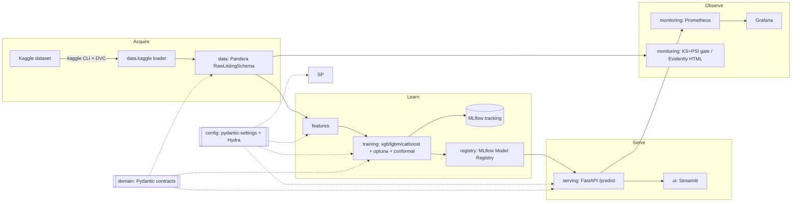

# PricePredictor

[](https://huggingface.co/spaces/Ununtri/price-predictor)
[](https://dagshub.com/UnuntriDev/Price-predictor.mlflow)
[](https://github.com/UnuntriDev/Price-predictor/actions/workflows/ci.yml)

**End-to-end MLOps pipeline that predicts Polish apartment prices from
the public Kaggle dataset** — versioned data, validated contracts,
training with conformal intervals and experiment tracking, a
registry-backed inference API, a Streamlit demo, and drift monitoring.
Built to portfolio quality: strict typing, Protocol-first interfaces,
dependency injection, and a reproducible toolchain.

The live demo Space pulls the production model from a public **DagsHub
MLflow** registry at startup (ADR 0011 wired); the same artefact is
trained from the **DVC-pinned** Kaggle snapshot (`data/raw.dvc`).

> **Status: Phase 2 — implemented.** The loop runs end to end:
> `make data → train (+ conformal) → MLflow register → serve /predict
> → drift gate + Evidently report`. Strict typing, tests, and CI are
> green. Scraping is retained only as an inactive illustrative skeleton
> (see Data Source & Ethics).

## Data Source & Ethics

Direct scraping of Polish real estate portals (Otodom, OLX) was
initially planned but proved infeasible due to aggressive anti-bot
protection (DataDome). The project pivoted to using a public Kaggle
dataset (Apartment Prices in Poland, krzysztofjamroz) which actually
provides richer features (POI distances, building condition) than basic
scraping would yield. The scraping module remains in the codebase as an
illustrative skeleton showing the architectural pattern, but is not
active in the data pipeline. This is a deliberate trade-off prioritizing
reproducibility and focus on MLOps over scraping engineering.

Fetch the data on demand (Kaggle token required; CSVs are never
committed, they are DVC-tracked):

```bash
make data        # kaggle download -> data/raw + dvc add
make data-push   # upload to the MinIO/S3 DVC remote
```

---

## Architecture



Layers depend on **ports** (`typing.Protocol`) and **contracts**
(`domain` Pydantic models, `data.schemas` Pandera schema), never on each
other's concrete adapters. `serving.asgi.get_app` is the only
composition root. See [`docs/decisions/`](docs/decisions/) for the ADRs.

## Quickstart

```bash
uv sync                 # locked environment (Python 3.12)
make check              # ruff + mypy --strict + pytest + pre-commit
make serve              # FastAPI at :8000  (GET /health, /metrics)
make ui                 # Streamlit at :7860
make up                 # full local stack (pg/mlflow/prometheus/grafana)
```

`make help` lists every target.

## Definition of done (Phase 1)

All green on a clean clone:

```bash
uv sync
uv run ruff check . && uv run ruff format --check .
uv run mypy src/
uv run pytest
docker compose config
pre-commit run --all-files
```

Plus a green GitHub Actions run (`.github/workflows/ci.yml`).

## Deployment trade-offs

The public demo is a **single Hugging Face Space** (Docker SDK): one
image, supervisord running Streamlit on `:7860` (public) and FastAPI on
`:8000` (internal, called over localhost). It serves a
**model-from-registry** only — no scraping, training, or persistence.

Postgres, MLflow, Prometheus, and Grafana run **only** in the local
`docker-compose.yml`. A Space is one container with one public port;
shipping a database and an observability stack there would be wrong, so
the heavy stack stays local by design. `docker-compose.spaces.yml`
reproduces the exact Space image locally. Rationale:
[ADR 0004](docs/decisions/0004-single-hf-spaces-image.md).

## Layout

```
src/price_predictor/   domain · config · scraping · data · features
                       training · registry · serving · monitoring · ui
configs/               Hydra groups (paths/data/model/training)
docker/                multi-stage Dockerfiles, supervisord, prometheus
docs/decisions/        ADRs
tests/unit + tests/integration   mirror src/
```

## Modelled fields

Target `price_pln`. Numeric: `square_meters`, `rooms`, `floor`,
`floor_count`, `build_year`, `centre_distance_km`, `poi_count` + 7 POI
distances. Categorical: `city`, `property_type`, `ownership`,
`building_material`, `condition`. Boolean: `has_*`. Bounds live in
`domain.constants`, shared by the Pydantic `Listing` and the Pandera
`RawListingSchema` so they cannot drift (ADR 0014).

## Results (model card)

Trained end to end with the committed code on the pinned Kaggle
snapshot — every number below was produced by `make train` against
`data/raw.dvc` (md5 `d4b0c88d…`, 195,568 rows · 11 monthly snapshots
2023-08 → 2024-06 · 15 cities), and the artefact is registered as
`price-predictor` v1 in the MLflow store.

| Metric | Test set |
|---|---:|
| MAE | **82,005 PLN** |
| RMSE | 121,818 PLN |
| MAPE | 10.68% |
| R² | **0.913** |
| Conformal half-width (α = 0.1) | ±179,588 PLN |
| Test rows | 39,114 (20% hold-out, seed 42) |

Model: xgboost (`n_estimators=600`, `max_depth=6`, `lr=0.05`) over a
`ColumnTransformer` (OHE on five categoricals, median imputation on
numerics). Conformal interval is split-conformal on a separate 20%
calibration fold (ADR 0008). Reproduce with `make data && make train`.

## Phase 2 — implemented

Design decisions are recorded in [ADRs 0006–0014](docs/decisions/).
Run the loop:

```bash
make up                # pg / mlflow / prometheus / grafana / api / ui / minio
make data              # Kaggle download -> data/raw + dvc add
make train             # data -> features -> fit -> conformal -> MLflow
make serve             # /predict: price + conformal interval
make drift             # KS+PSI gate + Evidently HTML report
```

- **Data** — Kaggle "Apartment Prices in Poland" via the Kaggle CLI;
  loader merges monthly sale snapshots, normalises, Pandera-validated;
  DVC-tracked on an S3-compatible MinIO remote (ADR 0009/0014).
- **Features** — median/sentinel imputation + feature selection;
  leakage-aware (target/ids never emitted).
- **Training** — `run_training` orchestrates validate→split→features→
  fit→**conformal**→evaluate→MLflow `log_and_register`; Optuna tuner.
- **Registry** — manual promotion gate with an automated
  `recommend_promotion` (promote/hold + metric delta).
- **Serving** — real `/predict` returns price + conformal interval;
  the artifact is loaded from the registry at startup.
- **Monitoring** — KS+PSI drift gate (deterministic) plus the Evidently
  HTML report job (ADR 0012).
- **Scraping** — inactive illustrative skeleton only (ADR 0013/0014;
  Otodom DataDome anti-bot).

- **Deploy** — the HF Space is model-free and pulls the production
  model from a remote MLflow registry at startup via a tolerant
  warmup (ADR 0011); supply `PP_MLFLOW__TRACKING_URI` (+ optional
  registry/model/stage) as Space secrets.

**Operator-only (no code left):** stand up the hosted MLflow server
and set the HF Space secrets; the deploy workflow already pushes the
image-config repo when `HF_TOKEN`/`HF_SPACE_ID` are present.

## License

MIT — see [LICENSE](LICENSE).
